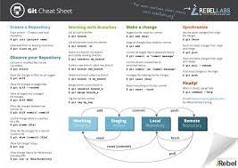

# TIL

## 리눅스 명령어

1. ls
   > list(목록표시)
2. cd
   > change directory(작업 경로 변경)
3. rm  
   rm remove(파일삭제)
4. mkdir<!--스페이스바 3번누르고 엔터면 다음으로 넘어감-->  
   make directory(작업목록 생성)
5. rmdir  
   remove directory(작업목록 삭제)
6. touch  
   파일생성
7. cat  
   파일의 내용 출력

## Git

1. init  
   git 생성
2. add<파일명>  
   staging area로 이동
3. commit -m <메세지>  
   Repository로이동
4. push <원격저장소><브랜치>  
   원격(GitHub)로 이동
5. pull <원격저장소><브랜치>  
   원격에서 로컬로
6. clone <원격저장소><브랜치>  
   원격에서 로컬로 복제
7. status
   Staging Area의 상태(Git의상태)
8. log  
   commit된 상태
9. git commmit --amend  
   바로전 commit과 Staging Area의 Merge할 때 사용
10. git restore --staged <파일명>  
     Staging Area의 파일을 Working Directory로 가져옴
    

### 문자코드

- 문자와 숫자를1:1매핑시켜좋은 값
- 컴퓨터가 사용하는 0과 1로 변환할때 사용되는 기준

### 진법

- 진수:10(사람)2,8,16
- 기계:0과 1만 사용

### Bit와 Byte

- Bit:0과 1만 표현
- Byte:8비트

### 진법

- 2진법:0과1
- 8진법:0~7
- 10진법:0~9
- 16진법:0~9 A(10) B(11) C(12) D(13) E(14) F(15)

### 2진법을 10진법으로 바꾸는법

1101₂ = 1x2³ + 1x2² + 0x2¹ + 1x2  
 = 1x8 + 1x4 +0x2 + 1x1  
 = 8 + 4 + 1  
 =13

### 8진법을 10진법으로 바꾸는법

257(8) = 2x8² + 5x8¹ + 7x8  
 = 2x64 + 5x8 +7x1  
 =128 + 40 + 7  
 =175
